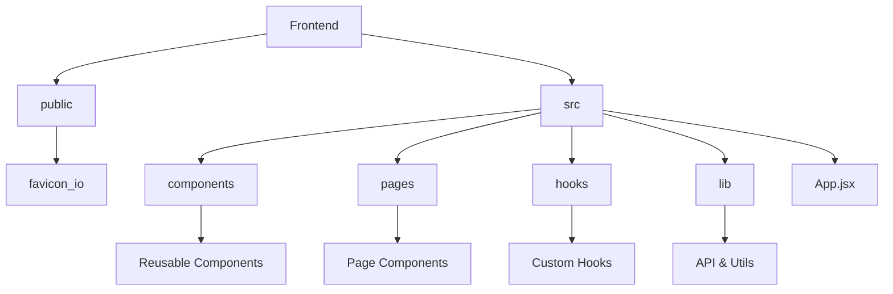
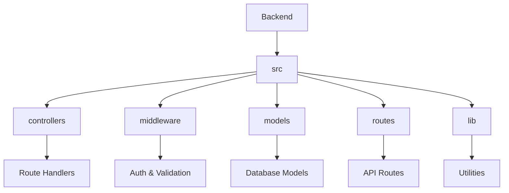
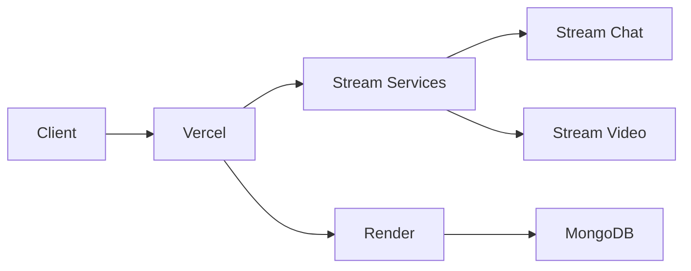

# Talkly - Real-time Language Exchange Platform

<div align="center">
  
  
  <p>
    <strong>Connect with language partners worldwide. Chat, video call, and practice speaking with native speakers.</strong>
  </p>

  <div>
    <a href="https://talkly-chat.vercel.app">
      
    </a>
    <a href="https://talkly.onrender.com">
      
    </a>
  </div>
</div>

## 🌟 Features

<div align="center">
  <table>
    <tr>
      <td align="center">
        
        <br/>
        Real-time Chat
      </td>
      <td align="center">
        
        <br/>
        Video Calls
      </td>
      <td align="center">
        
        <br/>
        User Auth
      </td>
      <td align="center">
        
        <br/>
        Partner Matching
      </td>
    </tr>
  </table>
</div>

## 🏗️ Project Structure

### Frontend Architecture


### Backend Architecture


### System Architecture


## 🚀 Deployment

<details>
<summary><b>Frontend (Vercel)</b></summary>

1. Push your code to GitHub repository
2. Go to [Vercel](https://vercel.com)
3. Import your repository
4. Configure environment variables:
   ```env
   VITE_STREAM_API_KEY=your_stream_api_key
   VITE_API_URL=your_backend_url
   ```
5. Deploy
</details>

<details>
<summary><b>Backend (Render)</b></summary>

1. Push your code to GitHub repository
2. Go to [Render](https://render.com)
3. Create a new Web Service
4. Connect your GitHub repository
5. Configure environment variables:
   ```env
   PORT=10000
   MONGODB_URI=your_mongodb_uri
   JWT_SECRET=your_jwt_secret
   STREAM_API_KEY=your_stream_api_key
   STREAM_API_SECRET=your_stream_api_secret
   ```
6. Deploy
</details>

## 🛠️ Local Development

<details>
<summary><b>Frontend Setup</b></summary>

```bash
cd frontend
npm install
npm run dev
```
</details>

<details>
<summary><b>Backend Setup</b></summary>

```bash
cd backend
npm install
npm run dev
```
</details>

## 🔧 Environment Variables

<details>
<summary><b>Frontend (.env)</b></summary>

```env
VITE_STREAM_API_KEY=your_stream_api_key
VITE_API_URL=http://localhost:10000
```
</details>

<details>
<summary><b>Backend (.env)</b></summary>

```env
PORT=10000
MONGODB_URI=your_mongodb_uri
JWT_SECRET=your_jwt_secret
STREAM_API_KEY=your_stream_api_key
STREAM_API_SECRET=your_stream_api_secret
```
</details>

## 📝 License

This project is licensed under the MIT License - see the [LICENSE](LICENSE) file for details.

## 👥 Contributing

<div align="center">
  
  
  
</div>

1. Fork the repository
2. Create your feature branch (`git checkout -b feature/AmazingFeature`)
3. Commit your changes (`git commit -m 'Add some AmazingFeature'`)
4. Push to the branch (`git push origin feature/AmazingFeature`)
5. Open a Pull Request

## 🔗 Links

<div align="center">
  <a href="https://talkly-chat.vercel.app">
    
    Live Demo
  </a>
  •
  <a href="https://github.com/Vipash0006/Talkly--realtime-chatting-">
    
    GitHub Repository
  </a>
  •
  <a href="https://talkly-backend.onrender.com">
    
    Backend API
  </a>
</div>

## 🙏 Acknowledgments

<div align="center">
  <table>
    <tr>
      <td align="center">
        <a href="https://getstream.io/chat/">
          
          <br/>
          Stream Chat
        </a>
      </td>
      <td align="center">
        <a href="https://getstream.io/video/">
          
          <br/>
          Stream Video
        </a>
      </td>
      <td align="center">
        <a href="https://vercel.com">
          
          <br/>
          Vercel
        </a>
      </td>
      <td align="center">
        <a href="https://render.com">
          
          <br/>
          Render
        </a>
      </td>
    </tr>
  </table>
</div> 